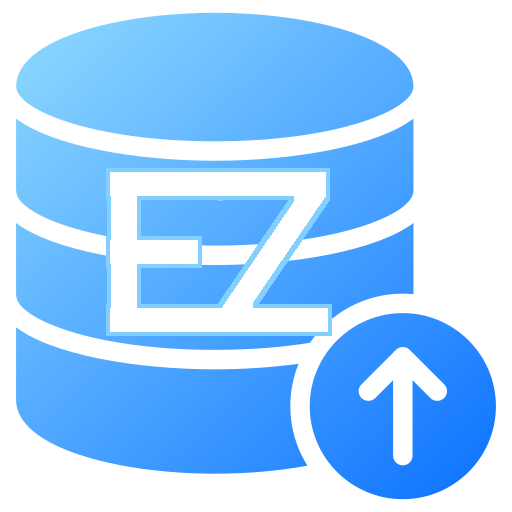

# EZSave

  

**EZSave** is a file backup application that allows users to perform **full** and **differential** backups automatically.  

## V1 - TUI

📖 See the documentation for V1 usage in [USING-TUI](doc/USING-TUI.md)

## V2 - GUI

📖 See the documentation for V2 usage in [USING-GUI](doc/USING-GUI.md)

## V3 - GUI/Remote

📖 See the documentation for V3 usage in [USING-GUI](doc/USING-GUIv3.md)

---

### Contributors :
- *Sean L.* (@haksolot)
- *Estelle L.* (@Estelle64)
- *Fabien C.* (@GahikoVON)
- *Matteo B.* (@BiscuitIntrusif)
